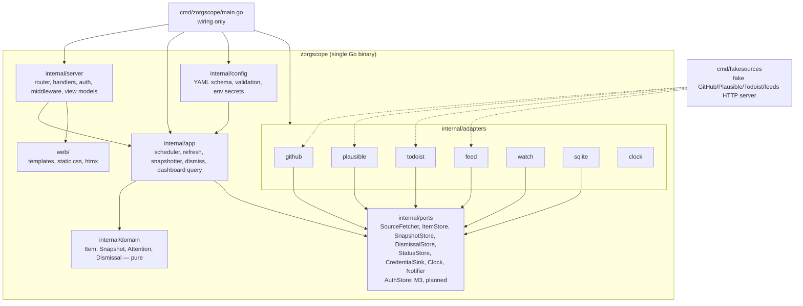

# 5. Building block view

## 5.1 Level 1 – the zorgscope binary



Import rules (enforced by `depguard`):

| Package | May import |
|---------|-----------|
| `internal/domain` | std lib only |
| `internal/ports` | `domain`, std lib |
| `internal/app` | `domain`, `ports`, `config`, std lib |
| `internal/adapters/*` | `domain`, `ports`, its own third‑party client libs, std lib |
| `internal/server` | `app`, `domain`, `config`, `ports` (auth store), `web` (embedded FS), webauthn lib, std lib |
| `cmd/*` | everything (wiring) |

### Responsibilities

| Block | Responsibility | Key types / functions |
|-------|----------------|-----------------------|
| `internal/domain` | Data model and rules: age buckets, `IsNew(item, prevSnapshot)`, `IsUnanswered(item, grace, me, collaborators)`, `Attention(item, ctx) Level`, dismissal expiry, snapshot diff, item identity (`ItemID{SourceID, ExternalID}`), sorting/capping. | `Item`, `Kind`, `ItemID`, `Snapshot`, `Dismissal`, `Bucket`, `AttentionLevel`, `Rules` |
| `internal/ports` | Interfaces the app depends on; in‑memory fakes for tests live in `ports/memstore`. | `SourceFetcher{ID() string; Kind() string /*source kind*/; Fetch(ctx) ([]Item, error)}`, `ItemStore`, `SnapshotStore`, `DismissalStore`, `StatusStore`, `Store` (bundles the four store ports), `CredentialSink` (adapters report auto‑detected expiries), `Clock`, `Notifier` (reserved for later push channels, unused in v1). `AuthStore` is M3 scope (passkeys, sessions) — not yet defined. |
| `internal/config` | Parse `zorgscope.yaml`, merge env secrets, validate, expose typed config; hot reload (SIGHUP/fsnotify, local). | `Load(path, env) (Config, error)`, `Validate` |
| `internal/app` | Use cases: `Scheduler` (ticker per source, jitter, backoff, single‑flight), `RefreshAll`, `Snapshotter` (daily + catch‑up + prune), `Dismiss`, `DashboardQuery` (assemble tile view models from stores + rules), `SourceRegistry` (kind → adapter constructor). | `Scheduler`, `Snapshotter`, `Dashboard`, `Registry` |
| `internal/adapters/github` | GraphQL client, pagination, mapping to `Item` (issue/pr/workflow‑run), notifications REST for mentions, rate‑limit awareness, ETag. | `RepoFetcher`, `MentionsFetcher` |
| `internal/adapters/plausible` | Stats API v2 queries: aggregates 7 d/30 d with comparison, timeseries, top pages → `Item{Kind: MetricSeries}`. | `SiteFetcher` |
| `internal/adapters/todoist` | Tasks due ≤ +7 d and overdue, projects; mapping to `Item{Kind: Task}`. | `TasksFetcher` |
| `internal/adapters/feed` | `gofeed` parsing, conditional GET, dedup by canonical URL, keyword filters → `Item{Kind: Article}`. | `FeedFetcher` |
| `internal/adapters/watch` | Credential registry from config → `Item{Kind: Credential}` (expiry payload); URL health checks (status, body marker, TLS cert expiry) → `Item{Kind: HealthCheck}`; receives auto‑detected expiries (GitHub token header) via `CredentialSink` port. | `CredentialsFetcher`, `URLFetcher` |
| `internal/adapters/sqlite` | Schema/migrations (embedded SQL), implementations of all store ports, WAL, pragmas. | `Store` implementing all `*Store` ports |
| `internal/adapters/clock` | Real clock; fake clock in tests. | `Clock` |
| `internal/server` | Router (`net/http` mux), handlers `/`, `/tiles/{name}`, `/dismiss`, `/refresh`, `/status`, `/login`, `/enroll`, `/account`, `/logout`, `/healthz`, `/readyz`, `/static/*`; middleware (session, CSRF, security headers, request log, gzip); WebAuthn ceremonies; template rendering with view models. | `Server`, `Handlers`, `Auth` |
| `web/` | `templates/` (layout, page, one partial per tile and per state), `static/` (`tokens.css`, `app.css`, `htmx.min.js`, icons). Embedded via `embed.FS`. | — |
| `internal/logging` | JSON `slog` logger with secret redaction (QS‑3.3). | `New(w, level, secrets)` |
| `cmd/zorgscope` | Wiring, flags, graceful shutdown; `sources.go` registers all source kinds. | `main` |
| `cmd/fakesources` | Deterministic HTTP fakes of all upstreams with a small control API (`POST /__control/issues` to inject events) for e2e. | `main` |

## 5.2 Level 2 – `internal/domain`

```text
domain/
  item.go          Item, Kind, ItemID, and every *Payload struct (Issue, PR, WorkflowRun, Mention, Task,
                    Article, MetricSeries, Credential, HealthCheck); ItemID = SourceID | ExternalID
                    ("/" cannot be the separator: source ids such as "github:owner/repo" already contain one)
  buckets.go       Bucket(age) → LT24h | LT7d | LT30d | GE30d
  snapshot.go      Snapshot{SourceID, Date, TakenAt, IDs}; Diff(prev, cur) (added, removed)
  dismissal.go     Dismissal{ItemID, UpdatedAt, DismissedAt}; Covers(item) bool
  attention.go     Level (None, Aged, Stale, Expiring, Unanswered, New, BuildFailed, Expired, Down, AuthFailed), Rules struct (Grace, StaleAfter, Me, Bots), Evaluate(item, prevSnapshot, dismissal, now)
  sort.go          attention ordering: level desc, created desc; cap with overflow count
  fetchstatus.go   FetchStatus{SourceID, Kind, LastSuccess, LastError, ErrorMsg, NextRun, ItemCount, Duration, InFlight, AuthFailed}
```

All payload structs currently live together in `item.go`; splitting them into per-kind files (e.g. `metrics.go`,
`task.go`, `watch.go`) is an option worth revisiting for M2 once the payloads grow, but is not planned for M1.

No I/O, no time.Now(), no logging in this package.
