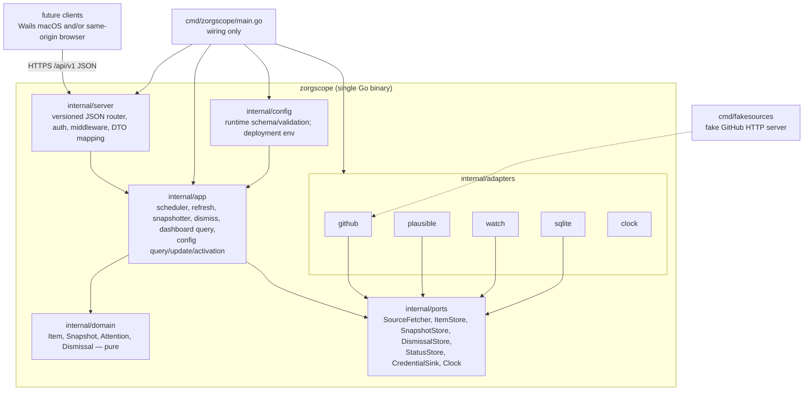

# 5. Building block view

## 5.1 Level 1 – the zorgscope binary



Import rules (enforced by `depguard`):

| Package | May import |
|---------|-----------|
| `internal/domain` | std lib only |
| `internal/ports` | `domain`, std lib |
| `internal/app` | `domain`, `ports`, `config`, std lib |
| `internal/adapters/*` | `domain`, `ports`, its own third‑party client libs, std lib |
| `internal/server` | `app`, `domain`, `config`, `ports` (auth store), `web` (embedded FS), webauthn lib, std lib |
| `cmd/*` | everything (wiring) |

### Responsibilities

| Block | Responsibility | Key types / functions |
|-------|----------------|-----------------------|
| `internal/domain` | Data model and rules: age buckets, `IsNew(item, prevSnapshot)`, `IsUnanswered(item, grace, me, collaborators)`, `Attention(item, ctx) Level`, dismissal expiry, snapshot diff, item identity (`ItemID{SourceID, ExternalID}`), sorting/capping. | `Item`, `Kind`, `ItemID`, `Snapshot`, `Dismissal`, `Bucket`, `AttentionLevel`, `Rules` |
| `internal/ports` | Interfaces the app depends on; in‑memory fakes for tests live in `ports/memstore`. | `SourceFetcher{ID() string; Kind() string /*source kind*/; Fetch(ctx) ([]Item, error)}`, `ItemStore`, `SnapshotStore`, `DismissalStore`, `StatusStore`, `Store` (bundles the four store ports), `CredentialSink` (adapters report auto‑detected expiries), `Clock`, `Notifier` (reserved for later push channels, unused in v1). `AuthStore` is M3 scope (passkeys, sessions) — not yet defined. |
| `internal/config` | Strict validation, read-only deployment settings, revisioned runtime YAML and encrypted write-only provider secrets. | `Config`, `Manager`, `Document`, `Validate` |
| `internal/app` | Scheduler, refresh, snapshots, dismissals, dashboard query and live whole-generation source replacement. | `Scheduler`, `Snapshotter`, `Dashboard`, `Runtime`, `Registry` |
| `internal/adapters/github` | GraphQL client, pagination, mapping to `Item` (issue/pr/workflow‑run), notifications REST for mentions, rate‑limit awareness, ETag. | `RepoFetcher`, `MentionsFetcher` |
| `internal/adapters/plausible` | Stats API v2 queries: aggregates 7 d/30 d with comparison, timeseries, top pages → `Item{Kind: MetricSeries}`. | `SiteFetcher` |
| `internal/adapters/watch` | Credential/API-key registry and URL/TLS endpoint checks; receives auto-detected GitHub token expiry through `CredentialSink`. | `CredentialsFetcher`, `URLFetcher` |
| `internal/adapters/sqlite` | Schema/migrations and cached items, status, dismissals and snapshots. | `Store` implementing all store ports |
| `internal/config.Manager` | Bootstrap/runtime precedence, complete revisioned updates and AES-GCM provider-secret storage; key supplied only by deployment config. | `Document`, `Update`, `SetSecret`, `ClearSecret` |
| `internal/adapters/clock` | Real clock; fake clock in tests. | `Clock` |
| `internal/server` | Router for `/api/v1/dashboard`, `/api/v1/status`, dismissal/refresh and complete `/api/v1/config` family; bootstrap bearer auth, JSON/errors, security/request middleware; health routes. | `Server`, `Handlers`, `Auth` |
| `internal/logging` | JSON `slog` logger with secret redaction (QS‑3.3). | `New(w, level, secrets)` |
| `cmd/zorgscope` | Wiring, flags, graceful shutdown; `sources.go` registers all source kinds. | `main` |
| `cmd/fakesources` | Deterministic fake GitHub with a small control API (`POST /__control/issues` to inject events) for e2e. | `main` |

## 5.2 Level 2 – `internal/domain`

```text
domain/
  item.go          Item, Kind, ItemID, and every *Payload struct (Issue, PR, WorkflowRun, Mention,
                    MetricSeries, Credential, HealthCheck); ItemID = SourceID | ExternalID
                    ("/" cannot be the separator: source ids such as "github:owner/repo" already contain one)
  buckets.go       Bucket(age) → LT24h | LT7d | LT30d | GE30d
  snapshot.go      Snapshot{SourceID, Date, TakenAt, IDs}; Diff(prev, cur) (added, removed)
  dismissal.go     Dismissal{ItemID, UpdatedAt, DismissedAt}; Covers(item) bool
  attention.go     Level (None, Aged, Stale, Expiring, Unanswered, New, BuildFailed, Expired, Down, AuthFailed), Rules struct (Grace, StaleAfter, Me, Bots), Evaluate(item, prevSnapshot, dismissal, now)
  sort.go          attention ordering: level desc, created desc; cap with overflow count
  fetchstatus.go   FetchStatus{SourceID, Kind, LastSuccess, LastError, ErrorMsg, NextRun, ItemCount, Duration, InFlight, AuthFailed}
```

All payload structs currently live together in `item.go`; splitting metrics/watch into per-kind files can be
revisited if those payloads grow.

No I/O, no time.Now(), no logging in this package.
