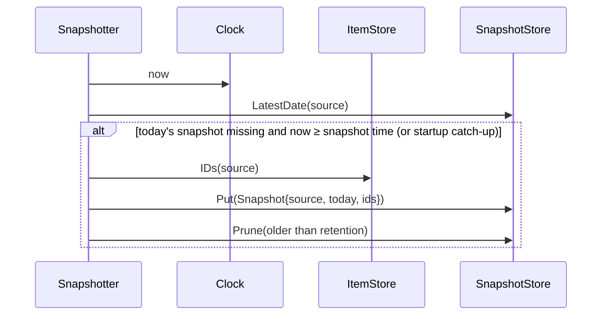

# 6. Runtime view

## 6.1 Background poll of one source

```mermaid
sequenceDiagram
    participant S as Scheduler (app)
    participant F as SourceFetcher (adapter)
    participant U as Upstream API
    participant IS as ItemStore (sqlite)
    participant ST as StatusStore
    S->>S: ticker(source.interval ± jitter) fires; single-flight guard
    S->>F: Fetch(ctx with timeout)
    F->>U: HTTP request(s), pagination, ETag
    U-->>F: data / error
    alt success
        F-->>S: []Item
        S->>IS: ReplaceItems(sourceID, items) (transaction; keeps first_seen)
        S->>ST: RecordSuccess(sourceID, now, count, duration)
        S->>S: reset backoff
    else error
        F-->>S: error (typed: RateLimited{ResetAt} | Auth | Transient | Permanent)
        S->>ST: RecordError(sourceID, now, err)
        S->>S: next run = backoff (1m,2m,4m … max 30m) or ResetAt
    end
```

The GitHub adapter additionally reports the `GitHub-Authentication-Token-Expiration` header (if present) through
the `CredentialSink` port so the Watch tile shows zorgscope's own token expiry (FR‑11.2).

Items are replaced per source atomically; `first_seen` is preserved for existing ids so "since last visit"
(FR‑7.4) works. Removed items (closed issues) are deleted from the cache but not from snapshots.

## 6.2 Dashboard read (`GET /api/v1/dashboard`)

1. Middleware validates the bootstrap bearer token (later a revocable device credential); invalid requests
   receive 401 without data.
2. `DashboardQuery.Build(now)` loads items, previous snapshots, dismissals and fetch status from SQLite,
   then applies `domain.Evaluate` and produces presentation-ready DTOs.
3. Encode one versioned JSON response with attention, repositories, Plausible, watch and per-source
   freshness/error state. Set `ETag` from the effective DTO revision/hash.
4. `If-None-Match` returns 304 when unchanged. A client may cache the last full response, but the backend
   remains authoritative.

No upstream call happens on the read path. Target: TTFB ≤ 150 ms (QS‑2.1).

## 6.3 Dismiss

`POST /api/v1/dismissals {item_id, updated_at}` (authenticated JSON) → `DismissalStore.Put` → 204.
Dismissal covers the item while `item.updated_at == dismissal.updated_at`.

## 6.4 Daily snapshot and catch‑up



The **snapshot day** is the date of the most recent scheduled snapshot time at or before now (before 03:00
it is still yesterday's date). The snapshotter takes at most one snapshot per source and snapshot day; a
missed one is taken at the next check (catch‑up). "Previous snapshot" for new‑detection = the latest
snapshot whose date < the current snapshot day, so every item stays `NEW` for at least 24 h and at most
48 h. If no previous snapshot exists (first day), the rule falls back to `created_at ≥ now − 24 h`.
Sources without a successful fetch are not snapshotted (an empty snapshot would be noise).

## 6.5 Authentication

The bootstrap implementation validates `Authorization: Bearer <ZORGSCOPE_API_TOKEN>` in constant time
for all `/api/v1/*` routes. Invalid attempts are safely logged and globally limited to ten per minute;
valid credentials are checked before the limiter and therefore cannot be locked out by an attacker. The
token comes only from deployment configuration and is redacted from logs. This is explicitly interim.

The target flow opens the system browser for WebAuthn/passkey authentication and uses an authorisation
code plus PKCE to issue a rotating, revocable per-device credential to Wails. A same-origin browser client
uses the equivalent passkey session. That flow will replace bootstrap auth without changing API resources.

## 6.6 Manual refresh

`POST /api/v1/refresh` → `Scheduler.TriggerAll()` (skips sources fetched more recently than the configured
minimum gap) → 202; clients obtain progress from `/api/v1/status` or the next dashboard response.

## 6.7 Runtime configuration update

1. Authenticated client reads `GET /api/v1/config` and receives non-secret effective values, secret
   presence flags and revision `r`.
2. Client sends the complete editable document to `PUT /api/v1/config` with `If-Match: r`; partial PATCH
   is deliberately unsupported.
3. Handler decodes strictly and the manager validates the complete candidate. Malformed/unknown JSON
   returns 400, semantic validation returns 422, and a stale revision returns 409.
4. Under one mutation lock, the manager atomically writes mode-0600 runtime YAML and asks the runtime to
   build a replacement source generation. It cancels and drains the old generation only after the new
   one builds successfully. Activation failure restores the exact prior file/state/revision; success
   commits the manager state before releasing the lock, so concurrent mutations cannot activate out of
   order. Removed source rows are filtered from subsequent dashboard reads.
5. Provider secrets use the same transaction semantics on separate revision-protected PUT/DELETE routes.
   AES-256-GCM ciphertext is written atomically to a second mode-0600 volume file under
   `ZORGSCOPE_CONFIG_KEY`; reads expose status only.
6. Decryption or validation failure fails closed and never falls back from an explicit cleared-secret
   tombstone to an older environment value.

## 6.8 Startup

`main`: load the bootstrap/runtime manager → require `ZORGSCOPE_API_TOKEN` and
`ZORGSCOPE_CONFIG_KEY` → decrypt managed provider-secret overrides → validate effective config → open
SQLite and migrate → build adapters from registry → start scheduler
(immediate first fetch of every source, staggered) → snapshotter catch‑up → HTTP server → on SIGTERM
graceful shutdown (stop tickers, wait for in‑flight fetches ≤ 10 s, close DB).
