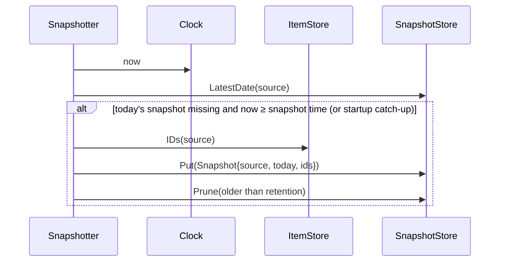

# 6. Runtime view

## 6.1 Background poll of one source

```mermaid
sequenceDiagram
    participant S as Scheduler (app)
    participant F as SourceFetcher (adapter)
    participant U as Upstream API
    participant IS as ItemStore (sqlite)
    participant ST as StatusStore
    S->>S: ticker(source.interval ± jitter) fires; single-flight guard
    S->>F: Fetch(ctx with timeout)
    F->>U: HTTP request(s), pagination, ETag
    U-->>F: data / error
    alt success
        F-->>S: []Item
        S->>IS: ReplaceItems(sourceID, items) (transaction; keeps first_seen)
        S->>ST: RecordSuccess(sourceID, now, count, duration)
        S->>S: reset backoff
    else error
        F-->>S: error (typed: RateLimited{ResetAt} | Auth | Transient | Permanent)
        S->>ST: RecordError(sourceID, now, err)
        S->>S: next run = backoff (1m,2m,4m … max 30m) or ResetAt
    end
```

Items are replaced per source atomically; `first_seen` is preserved for existing ids so "since last visit"
(FR‑7.4) works. Removed items (closed issues) are deleted from the cache but not from snapshots.

## 6.2 Page load (`GET /`)

1. Middleware: session cookie → user; no session → 302 `/login`.
2. `DashboardQuery.Build(now)`: for each enabled tile load items from `ItemStore`, previous snapshot from
   `SnapshotStore`, dismissals, fetch status → `domain.Evaluate` per item → view models (already sorted, capped, bucketed).
3. Render `page.html` with all tile partials inline (one round trip). Set `ETag` from a hash of view models.
4. Browser: htmx attributes on each tile start `hx-trigger="every 60s"` → `GET /tiles/{name}` returning only that partial (304 if unchanged).
5. Update `last_visit_at` in the auth store (throttled to once per minute).

No upstream call happens on the read path. Target: TTFB ≤ 150 ms (QS‑2.1).

## 6.3 Dismiss

`POST /dismiss {item_id, updated_at}` (htmx, CSRF token) → `DismissalStore.Put` → returns the re‑rendered
Attention tile partial. Dismissal covers the item while `item.updated_at == dismissal.updated_at`.

## 6.4 Daily snapshot and catch‑up



"Previous snapshot" for new‑detection = the latest snapshot whose date < today's snapshot date; if only
today's exists (first day), the rule falls back to `created_at ≥ now − 24 h`.

## 6.5 Passkey enrolment and login

Enrolment: `GET /enroll?token=…` → constant‑time compare with `ENROLL_TOKEN` (or existing session) →
WebAuthn `BeginRegistration` (challenge in short‑lived signed cookie) → browser `navigator.credentials.create`
→ `POST /enroll/finish` → credential stored → session created.

Login: `GET /login` → `BeginLogin` (discoverable credentials, no username) → `navigator.credentials.get` →
`POST /login/finish` → verify, update sign count → session cookie → redirect `/`.

The tiny amount of JS for WebAuthn lives in `web/static/auth.js` (self‑hosted, CSP‑compliant).

## 6.6 Manual refresh

`POST /refresh` → `Scheduler.TriggerAll()` (skips sources fetched < 30 s ago) → 202; header polls
`GET /tiles/header` which shows "refreshing (3/12)…" from `StatusStore.InFlight()`.

## 6.7 Startup

`main`: load config + env → open SQLite, migrate → build adapters from registry → start scheduler
(immediate first fetch of every source, staggered) → snapshotter catch‑up → HTTP server → on SIGTERM
graceful shutdown (stop tickers, wait for in‑flight fetches ≤ 10 s, close DB).
