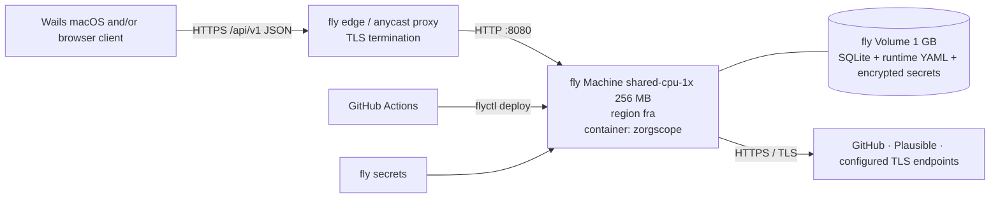

# 7. Deployment view

## 7.1 Production – fly.io

* `deploy/fly.toml`: `min_machines_running = 1`, `auto_stop_machines = "off"`, HTTP checks on `/readyz`
  and a volume mounted at `/data`.
* Runtime configuration persists as `/data/zorgscope.yaml`; encrypted upstream-secret overrides persist
  as `/data/zorgscope.secrets`. Both are managed through `/api/v1/config`; ordinary changes do not rebuild
  or deploy the image.
* Required deployment secrets: `ZORGSCOPE_API_TOKEN` and `ZORGSCOPE_CONFIG_KEY`. The Fly bootstrap seed
  keeps GitHub/Plausible disabled; set their credentials through the write-only API, then enable them with
  one complete config PUT. Environment provider tokens remain optional fallback/bootstrap values.
* Image: multi-stage `deploy/Dockerfile` - `golang:1.26` build (CGO disabled, `-trimpath -ldflags "-s -w"`),
  final `gcr.io/distroless/static-debian12:nonroot`.

## 7.2 Local – Docker Compose (`make app`)

`deploy/compose.yml`: service `zorgscope` built from the same Dockerfile, port `8080:8080`, env from `.env`,
named volume `zorgscope-data:/data`, and development bootstrap credentials. Runtime config persists on
the named volume and is changed through the same API used in production.

## 7.3 E2E – Docker Compose (`make e2e`)

`deploy/compose.e2e.yml`: services `fakesources`, `zorgscope` (runtime config points adapters at the fake),
and the current Chromium HTML smoke runner. API-contract and client-specific suites are added with each
visual client.

## 7.4 CI – GitHub Actions

`.github/workflows/ci.yml` on push/PR runs lint, unit/integration/domain tests, docs checks, image build and
Compose e2e. `.github/workflows/deploy.yml` runs after successful `main` CI (or manual dispatch) and uses
`flyctl deploy --remote-only` with repository secret `FLY_API_TOKEN`.
