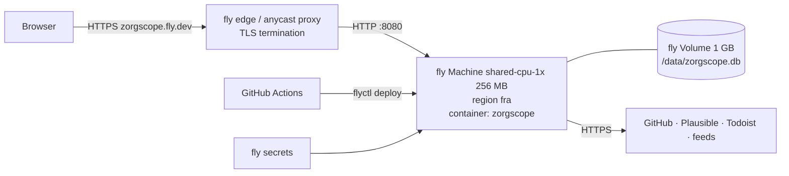

# 7. Deployment view

## 7.1 Production – fly.io

* `deploy/fly.toml`: `min_machines_running = 1`, `auto_stop_machines = "off"`, HTTP checks on `/healthz`,
  mount `/data`, `[env] ZORGSCOPE_CONFIG=/app/config/zorgscope.yaml`.
* Config file is baked into the image (copied from `config/`), so config changes deploy via CI.
* Secrets: `GITHUB_TOKEN`, `PLAUSIBLE_API_KEY`, `TODOIST_TOKEN`, `SESSION_SECRET`, `ENROLL_TOKEN` (`fly secrets set`).
* Image: multi‑stage `deploy/Dockerfile` – `golang:1.26` build (CGO disabled, `-trimpath -ldflags "-s -w"`),
  final `gcr.io/distroless/static:nonroot`; ~15–20 MB.
* Cost: one shared‑cpu‑1x + 1 GB volume ≈ 3–4 €/month.

## 7.2 Local – Docker Compose (`make app`)

`deploy/compose.yml`: service `zorgscope` built from the same Dockerfile, port `8080:8080`, env from `.env`,
named volume `zorgscope-data:/data`, `AUTH_MODE=dev` default in `env.example` (no passkey locally),
config mounted read‑only from `./config` so edits are picked up (FR‑8.5).

## 7.3 E2E – Docker Compose (`make e2e`)

`deploy/compose.e2e.yml`: services `fakesources` (from `cmd/fakesources`), `zorgscope` (env points all
adapters at `http://fakesources:9090`, `AUTH_MODE=dev` for content tests + a dedicated passkey test using
Playwright's virtual authenticator against `AUTH_MODE=passkey`), `playwright`
(`mcr.microsoft.com/playwright:v1.x-noble`, runs `test/e2e`). Exit code of `playwright` is the make result.

## 7.4 CI – GitHub Actions

`.github/workflows/ci.yml` on push/PR: `lint` → `test` (unit+integration, coverage gate) → `image` (build,
`govulncheck`) → `e2e` (compose) — each ≤ 10 min. `.github/workflows/deploy.yml` on push to `main` after
CI success: `flyctl deploy --remote-only` with `FLY_API_TOKEN`. Dependabot for gomod, github‑actions, docker.
