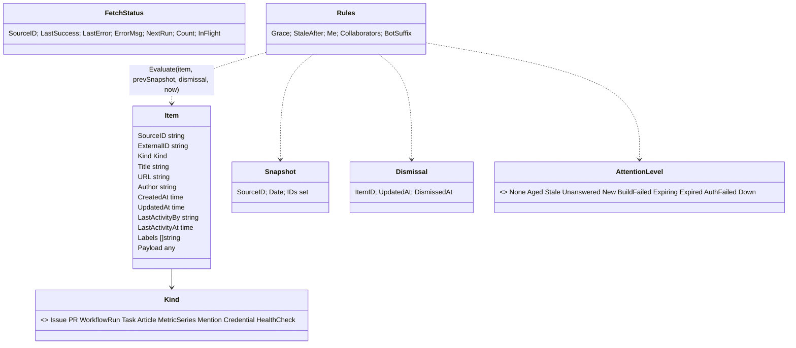

# 8. Cross‑cutting concepts

## 8.1 Domain model



Payload types per kind: `PRPayload{Draft, ReviewDecision, Additions}`, `WorkflowRunPayload{Conclusion, Status, Branch, RunID}`,
`TaskPayload{Project, Priority, Due, DueHasTime, Recurring}`, `ArticlePayload{Summary, Topic, FeedName}`,
`MetricSeriesPayload{Visitors7d, Visitors30d, Pageviews30d, DeltaVisitors7d, DeltaVisitors30d, Daily []int, TopPages []Page}`,
`CredentialPayload{Expires *time, WarnDays, UsedBy, URL, AutoDetected}`, `HealthCheckPayload{StatusCode, LatencyMs, OK, ConsecutiveFailures, CertExpires *time, LastOK}`.

## 8.2 Attention rules (the heart of QG‑1)

```text
Evaluate(item, prev, dismissal, now):
  if item.Kind == WorkflowRun and Conclusion == failure  → BuildFailed (unless dismissed for this RunID)
  if item.Kind == Credential:  Expires < now → Expired; Expires ≤ now+WarnDays → Expiring; else None   (dismissal keyed to Expires)
  if item.Kind == HealthCheck: !OK and ConsecutiveFailures ≥ 2 → Down; CertExpires ≤ now+WarnDays → Expiring; else None
  (source status auth_failed → synthetic item Kind=Credential, Title "AUTH FAILED: <source>", level AuthFailed; created by app layer from FetchStatus)
  new       := prev == nil ? item.CreatedAt ≥ now-24h : !prev.Contains(item.ID)
  unanswered:= item.Kind ∈ {Issue, PR}
               and item.CreatedAt ≤ now-Grace
               and (item.LastActivityBy == "" or item.LastActivityBy == item.Author or isBot(item.LastActivityBy))
  covered   := dismissal != nil and dismissal.UpdatedAt == item.UpdatedAt
  if covered → level = None (age bucket still shown)
  else if new → New; else if unanswered → Unanswered
  else if item.Kind ∈ {Issue,PR} and item.LastActivityAt ≤ now-StaleAfter → Stale
  else → Aged (i.e. only bucket colouring)
Bucket(item.CreatedAt, now) ∈ {<24h, <7d, <30d, ≥30d}
```

Rules are configurable (`github.grace_period`, `github.stale_after`, `github.me`, `github.bots`).
Collaborator answers: the GitHub adapter sets `LastActivityBy` from the last comment/review author; the
domain treats any author ≠ item author as an answer (bots excluded). Collaborator write‑access lookup is a
later refinement (O‑3‑adjacent), not needed for correctness of "someone reacted".

## 8.3 Configuration (`config/zorgscope.yaml`)

Full example (this is the initial production configuration, checked in):

```yaml
server:
  base_url: https://zorgscope.fly.dev   # used for cookies, WebAuthn RP ID/origin, absolute links
  port: 8080
  timezone: Europe/Berlin
ui:
  tile_poll_seconds: 60
  attention_cap: 30
  tiles: [attention, repos, sites, todoist, news, watch]     # order; omit to hide
snapshot:
  time: "03:00"
  retention_days: 30
github:
  enabled: true
  me: gernotstarke
  poll_interval: 10m
  grace_period: 4h
  stale_after: 720h            # 30 days
  bots: ["[bot]", "dependabot", "renovate"]
  mentions: true               # notifications for @me outside monitored repos
  repos:
    - arc42/arc42.org-site
    - arc42/arc42.de-site
    - arc42/arc42-template
    - arc42/docs.arc42.org-site
    - arc42/quality.arc42.org-site
    - arc42/faq.arc42.org-site
    - gernotstarke/esabuch.de-site
    - gernotstarke/gernotstarke.de-site
    # per-repo override example:
    # - name: arc42/arc42-template
    #   poll_interval: 5m
plausible:
  enabled: true
  poll_interval: 30m
  sites: [arc42.org, arc42.de, docs.arc42.org, quality.arc42.org, faq.arc42.org, esabuch.de, gernotstarke.de]
  order: visitors             # visitors | config
todoist:
  enabled: true
  poll_interval: 5m
  horizon_days: 7
feeds:
  enabled: true
  poll_interval: 30m
  max_items: 20
  group_by_topic: false
  sources: []                 # e.g. - {name: "Simon Willison", url: "https://simonwillison.net/atom/everything/", topic: ai}
watch:
  enabled: true
  warn_days: 14                # default for credentials and TLS certificates
  credentials:                 # manual registry; zorgscope's own GitHub token is added automatically (FR-11.2)
    - name: status.arc42.org GitHub token
      expires: 2026-12-31
      used_by: status.arc42.org
      url: https://github.com/settings/tokens
  urls:
    - name: status.arc42.org
      url: https://status.arc42.org
      expect_status: 200
      poll_interval: 15m
```

Secrets by env: `GITHUB_TOKEN`, `PLAUSIBLE_API_KEY`, `TODOIST_TOKEN`, `SESSION_SECRET` (≥ 32 bytes),
`ENROLL_TOKEN`; optional `AUTH_MODE` (`passkey` default, `dev` only for localhost), `ZORGSCOPE_CONFIG`
(path), `LOG_LEVEL`, and `*_BASE_URL` overrides per adapter (used by e2e to point at fake sources).
Validation: unknown keys are errors (`KnownFields(true)`), intervals ≥ 1 m, repos `owner/name`, sites
hostnames, base_url absolute, `me` non‑empty when github enabled.

## 8.4 Persistence (SQLite schema, migration 0001)

```sql
items      (source_id TEXT, external_id TEXT, kind TEXT, title TEXT, url TEXT, author TEXT,
            created_at INT, updated_at INT, last_activity_by TEXT, last_activity_at INT,
            labels TEXT/*json*/, payload TEXT/*json*/, first_seen INT, PRIMARY KEY(source_id, external_id));
snapshots  (source_id TEXT, date TEXT/*YYYY-MM-DD*/, taken_at INT, ids TEXT/*json array*/, PRIMARY KEY(source_id, date));
dismissals (source_id TEXT, external_id TEXT, updated_at INT, dismissed_at INT, PRIMARY KEY(source_id, external_id));
fetch_status (source_id TEXT PRIMARY KEY, kind TEXT, last_success INT, last_error INT, error_msg TEXT,
            next_run INT, item_count INT, duration_ms INT, in_flight INT);
account    (id INT PRIMARY KEY CHECK(id=1), created_at INT, last_visit_at INT);
credentials(id BLOB PRIMARY KEY, public_key BLOB, aaguid BLOB, sign_count INT, transports TEXT, name TEXT, created_at INT, last_used_at INT);
sessions   (id TEXT PRIMARY KEY, created_at INT, expires_at INT, last_seen_at INT, user_agent TEXT);
```

Pragmas: `journal_mode=WAL`, `synchronous=NORMAL`, `busy_timeout=5000`, `foreign_keys=ON`. Migrations are
embedded SQL files applied at start (`schema_version` table). Times are Unix seconds UTC.

## 8.5 UI and design system

* One layout template, one page template, one partial per tile (`tile_attention.html`, `tile_repos.html`,
  `tile_sites.html`, `tile_todoist.html`, `tile_news.html`, `tile_watch.html`, `tile_header.html`) plus shared partials for
  states (`state_empty.html`, `state_error.html`, `badge.html`).
* `web/static/tokens.css`: colour (surface, text, accent, ok, warn, danger, and a 4‑step age scale), spacing
  scale (4/8/12/16/24/32), radii, shadows, type scale; light and dark via `prefers-color-scheme`.
* `web/static/app.css`: grid (`grid-template-columns: repeat(auto-fit, minmax(340px, 1fr))`), tile card,
  list rows, badges, sparkline (inline SVG generated server‑side), reduced‑motion guard.
* htmx: `hx-get`/`hx-trigger="every Ns"` per tile, `hx-post` for dismiss/refresh with CSRF header set via
  `hx-headers`. Everything works without JS except tile auto‑refresh and passkeys.
* Tab title reflects attention count: `(3) zorgscope`.
* Accessibility: semantic lists, `aria-live="polite"` on tiles, badges with text, focus styles.

## 8.6 Security

Passkeys (ADR‑0006), sessions (random 256‑bit id, hashed in DB, sliding expiry), CSRF (double‑submit token in
`hx-headers`, plus `Origin`/`Sec-Fetch-Site` check), security headers (CSP `default-src 'self'; script-src
'self'; style-src 'self'; img-src 'self' data:; frame-ancestors 'none'`, HSTS in prod, `X-Content-Type-Options`,
`Referrer-Policy: no-referrer`), rate limiting on `/login*`, `/enroll*` (token bucket per IP), constant‑time
token compare, secrets redaction in `slog` handler (values of known secret env vars replaced), non‑root
distroless image, `govulncheck` in CI, least‑privilege upstream tokens (read‑only).

## 8.7 Error handling

* Adapters return typed errors: `ErrRateLimited{ResetAt}`, `ErrAuth`, `ErrTransient`, `ErrPermanent`
  (`errors.Is`/`As`); never panic on upstream data.
* `ErrAuth` additionally flags the source `auth_failed`, which the app layer turns into an `AUTH FAILED` attention item (FR‑11.3).
* Scheduler translates errors into `FetchStatus` + backoff; the UI shows "⚠ data from 14:02 · GitHub: 403 rate limited, retry 14:35".
* HTTP handlers: domain/store errors → 500 with generic page + logged; template errors are impossible at
  runtime because templates are parsed at start (`template.Must`) and golden‑tested.
* Config errors → exit code 2 with message; missing optional source secret with `enabled: false` is fine.

## 8.8 Logging & observability

`log/slog` JSON to stdout; fields `component`, `source_id`, `duration_ms`, `status`; request log middleware;
`/status` page for humans; `/healthz` liveness, `/readyz` readiness. No metrics endpoint in v1 (fly gives
machine metrics).

## 8.9 Testing (see ADR‑0010)

| Layer | Kind | Tooling | Location |
|-------|------|---------|----------|
| domain | unit, table‑driven, property‑style (`testing/quick` or `pgregory.net/rapid`) | `go test` | `internal/domain/*_test.go` |
| adapters | contract tests against `httptest` servers replaying fixtures; error‑path tests | `go test` | `internal/adapters/*/*_test.go`, fixtures in `test/fixtures/<adapter>/` |
| sqlite | store tests on temp DB; migration test | `go test` | `internal/adapters/sqlite/*_test.go` |
| app | scheduler with fake clock/fetchers; snapshotter; dashboard query | `go test -race` | `internal/app/*_test.go` |
| http | handler tests, auth tests, golden HTML for each tile state, security header tests, secret canary | `go test` | `internal/http/*_test.go`, goldens in `internal/http/testdata/` |
| e2e | Playwright (Chromium/Firefox/WebKit): login (virtual authenticator), tiles, dismiss, refresh, staleness, inject‑new‑issue, viewports, axe | Docker Compose | `test/e2e/` |
| architecture | import rules | `depguard` via golangci‑lint | `.golangci.yml` |

## 8.10 Time

All logic receives `now` from the `Clock` port; timezone from config for snapshot time and day grouping;
storage in UTC.
