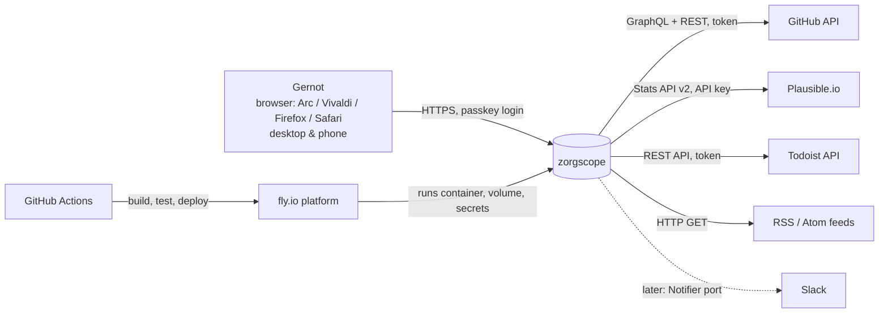

# 3. Scope and context

## 3.1 System scope

### In scope (v1)

* One web application (single Go binary) that
  * periodically fetches data from configured sources,
  * normalises, stores and snapshots it,
  * computes what needs attention,
  * renders a tile dashboard and serves it over HTTPS to one authenticated user.
* Configuration of sources by file, secrets by environment.
* Local run under Docker (`make app`), production run on fly.io, CI on GitHub Actions.
* Documentation: requirements, architecture, ADRs, plans, guides.

### Out of scope (v1)

See also W‑items in chapter 4.

* Writing back to any source (closing issues, completing tasks, …).
* Push notifications (Slack/e‑mail) — designed for, not built (`Notifier` port reserved).
* LLM‑based summarisation or ranking of news.
* Multi‑user, roles, sharing.
* Native desktop or mobile app.

## 3.2 Context diagram

## 3.3 External interfaces

| Id | System | Direction | Protocol / API | Data | Auth | Notes |
|----|--------|-----------|----------------|------|------|-------|
| EXT‑1 | GitHub | in | GraphQL v4 (`/graphql`); REST v3 for notifications | Open issues & PRs incl. last comment author, labels, timestamps; workflow runs on default branch; mentions / review requests for the configured user | Personal access token (fine‑grained or classic with `repo` — one monitored repo is private) | Rate limit 5 000 points/h; conditional requests where possible. |
| EXT‑2 | Plausible.io (cloud) | in | Stats API v2 (`POST /api/v2/query`) | visitors, pageviews for 7 d & 30 d incl. comparison to previous period; daily series for sparkline; top pages | API key | Rate limit 600 req/h per key. |
| EXT‑3 | Todoist | in | Todoist API (current unified v1; verify at implementation time) | tasks with due date ≤ today+7 d and overdue; project names, priority, labels | API token | Read only. |
| EXT‑4 | RSS/Atom publishers | in | HTTP GET, RSS 2.0 / Atom 1.0 / JSON Feed | title, link, published, summary | none | Use `ETag`/`If‑Modified‑Since`; polite intervals. |
| EXT‑5 | Browser | out | HTTPS, HTML, htmx partial responses | dashboard page & tile fragments | Passkey (WebAuthn) + session cookie | Also served on `http://localhost:8080` for local dev. |
| EXT‑6 | fly.io | env | container runtime, volume, secrets, HTTPS termination | — | fly API token (deploy) | Single machine, always on. |
| EXT‑8 | Watched URLs (own apps, e.g. status.arc42.org) | in | HTTPS HEAD/GET | status code, optional body marker, TLS certificate expiry | none | FR‑11.4; polite intervals (default 15 m). |
| EXT‑7 | Slack (later) | out | incoming webhook | new‑item alerts | webhook URL | Not in v1. |

## 3.4 Monitored objects (initial configuration)

Repositories (all issues + PRs + Actions status): `arc42/arc42.org-site`, `arc42/arc42.de-site`,
`arc42/arc42-template`, `arc42/docs.arc42.org-site`, `arc42/quality.arc42.org-site`, `arc42/faq.arc42.org-site`,
`gernotstarke/esabuch.de-site`, `gernotstarke/gernotstarke.de-site` (private).

Plausible sites: `arc42.org`, `arc42.de`, `docs.arc42.org`, `quality.arc42.org`, `faq.arc42.org`, `esabuch.de`, `gernotstarke.de`.

Todoist: the personal account of S‑1. Feeds: to be decided; the mechanism is provider‑agnostic.

Watched credentials and URLs: maintained by S‑1 in the config (initially the tokens used by zorgscope
itself and by status.arc42.org; URL `https://status.arc42.org`).

The list lives in `config/zorgscope.yaml` and is expected to grow (QG‑4).
