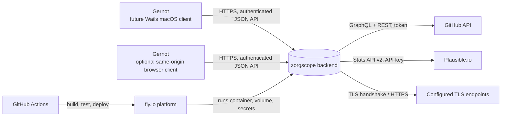

# 3. Scope and context

## 3.1 System scope

### In scope (v1)

* One always-on fly.io backend (single Go binary) that
  * periodically fetches data from configured sources,
  * normalises, stores and snapshots it,
  * computes what needs attention,
  * exposes an authenticated, versioned JSON API to visual clients.
* A client-neutral configuration API through which every runtime-configurable property can be read and
  changed. Upstream secrets are write-only and encrypted at rest.
* A future macOS Wails client and/or same-origin browser client; the backend contract does not privilege
  either option.
* Local run under Docker (`make app`), production run on fly.io, CI on GitHub Actions.
* Documentation: requirements, architecture, ADRs, plans, guides.

### Out of scope (v1)

See also W‑items in chapter 4.

* Writing back to any source (closing issues, completing tasks, …).
* Push notifications (Slack/e‑mail) — designed for, not built (`Notifier` port reserved).
* Todoist and news/feed aggregation (epics E-5 and E-6 are retired).
* Multi‑user, roles, sharing.
* Selecting or implementing the final visual client in the backend increment.

## 3.2 Context diagram

## 3.3 External interfaces

| Id | System | Direction | Protocol / API | Data | Auth | Notes |
|----|--------|-----------|----------------|------|------|-------|
| EXT‑1 | GitHub | in | GraphQL v4 (`/graphql`); REST v3 for notifications | Open issues & PRs incl. last comment author, labels, timestamps; workflow runs on default branch; mentions / review requests for the configured user | Personal access token (fine‑grained or classic with `repo` — one monitored repo is private) | Rate limit 5 000 points/h; conditional requests where possible. |
| EXT‑2 | Plausible.io (cloud) | in | Stats API v2 (`POST /api/v2/query`) | visitors, pageviews for 7 d & 30 d incl. comparison to previous period; daily series for sparkline; top pages | API key | Rate limit 600 req/h per key. |
| EXT‑3 | Todoist | — | — | — | — | **Retired:** deliberately removed from product scope; identifier retained for traceability. |
| EXT‑4 | RSS/Atom publishers | — | — | — | — | **Retired:** news feeds deliberately removed from product scope; identifier retained for traceability. |
| EXT‑5 | Visual clients | out | HTTPS, versioned JSON API (`/api/v1/*`), optional event stream later | dashboard snapshots, status, dismiss/refresh actions and complete runtime configuration | Bootstrap bearer token initially; passkey-backed device authentication planned | Supports Wails and same-origin browser clients without client-specific business rules. |
| EXT‑6 | fly.io | env | container runtime, volume, secrets, HTTPS termination | — | fly API token (deploy) | Single machine, always on. |
| EXT‑8 | TLS endpoints | in | TLS handshake and optional HTTPS HEAD/GET | certificate chain and expiry; optional status data | none by default | FR‑11.4; polite intervals (default 15 m). |
| EXT‑7 | Slack (later) | out | incoming webhook | new‑item alerts | webhook URL | Not in v1. |

## 3.4 Monitored objects (initial configuration)

Repositories (all issues + PRs + Actions status): `arc42/arc42.org-site`, `arc42/arc42.de-site`,
`arc42/arc42-template`, `arc42/docs.arc42.org-site`, `arc42/quality.arc42.org-site`, `arc42/faq.arc42.org-site`,
`gernotstarke/esabuch.de-site`, `gernotstarke/gernotstarke.de-site` (private).

Plausible sites: `arc42.org`, `arc42.de`, `docs.arc42.org`, `quality.arc42.org`, `faq.arc42.org`, `esabuch.de`, `gernotstarke.de`.

Watched credentials/API keys and TLS endpoints: maintained by S-1 through the configuration API
(initially the tokens used by zorgscope itself and by status.arc42.org; endpoint
`https://status.arc42.org`).

Runtime configuration lives in a mode-0600 YAML file and provider-secret envelope on the backend volume;
SQLite holds cached product state. Deployment-only bootstrap, encryption and network values remain
environment/Fly secrets and are intentionally absent from the runtime configuration API.
